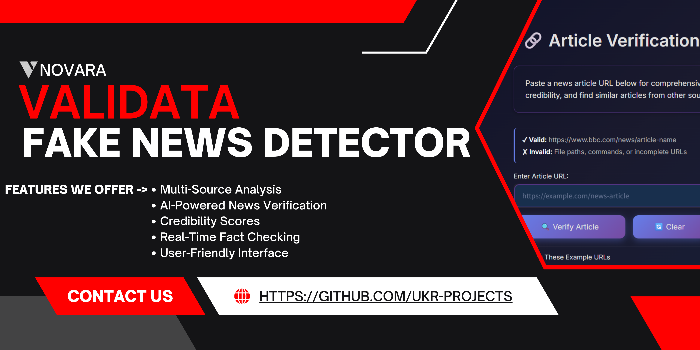
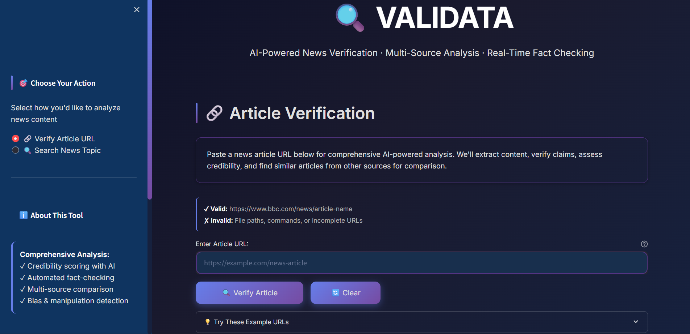

<h1>
  
  Validata
</h1>

[](LICENSE)
[](STATUS.md)
[](CHANGELOG.md)

<div align="center">
  
</div>

<div align="center">
  
</div>

---
## 🖼 Screenshot

<div align="center">
  
  <p><em>Validata UI/UX</em></p>
</div>

---

## 🎉 What’s New in v1.0.0

- **AI-Powered News Verification**: Leverage Google Gemini for deep article analysis.
- **Multi-Source Analysis**: Compare articles from various news outlets using NewsAPI.
- **Real-Time Fact Checking**: Automated claim verification to identify potential misinformation.
- **Credibility Scoring**: Get an overall credibility score for articles and sources.
- **Bias Detection**: Analyze political bias and sensationalism levels.
- **Interactive Frontend**: User-friendly Streamlit interface for seamless interaction.

---

## ✨ All Features
- **Article URL Verification**: Paste a news article URL to get a comprehensive AI-powered analysis.
- **News Topic Search**: Search for any news topic to get a neutral summary and source diversity analysis from multiple sources.
- **Detailed Credibility Reports**: Receive scores for source reputation, writing quality, evidence quality, objectivity, and transparency.
- **Claim Identification**: Automatically identify and assess the verifiability of factual claims.
- **Manipulation Tactic Detection**: Highlight potential manipulation tactics used in articles.
- **Similar Article Discovery**: Find related articles from other sources for cross-referencing.
- **Source Distribution Analysis**: Understand the diversity of sources in news searches.
- **Media Literacy Tips**: Get actionable advice to improve your critical thinking skills.

---

## 📁 Folder Structure

```
fake-news-detector/
├── .env                        # Environment variables for API keys
├── LICENSE                     # Project license
├── pyproject.toml              # Project metadata and dependencies (PEP 621)
├── README.md                   # Main project README
├── requirements.txt            # Python dependencies
├── assets/                     # Project assets (logos, banners, screenshots)
│   ├── validata-banner.png
│   ├── validata-logo.png
│   └── screenshots/
│       └── screenshot.png
├── backend/                    # FastAPI backend for AI services
│   ├── app.py                  # Main FastAPI application
│   ├── api/                    # API endpoints
│   │   ├── __init__.py
│   │   ├── search.py           # News search endpoint
│   │   └── verification.py     # Article verification endpoint
│   ├── services/               # Core AI and data extraction services
│   │   ├── __init__.py
│   │   ├── article_extractor.py # Extracts content from URLs
│   │   ├── credibility_scorer.py # Scores article credibility using Gemini
│   │   ├── fact_checker.py     # Fact-checks claims using Gemini
│   │   └── news_searcher.py    # Searches news using NewsAPI
│   └── utils/                  # Utility functions
│       ├── __init__.py
│       └── helpers.py          # General helper functions
├── docs/                       # Project documentation
│   ├── CHANGELOG.md
│   ├── CODE_OF_CONDUCT.md
│   ├── CONTRIBUTING.md
│   ├── README.md               
│   ├── SECURITY.md
│   ├── STATUS.md
│   └── USAGE.md
└── frontend/                   # Streamlit frontend application
    ├── api_client.py           # Handles communication with the backend API
    ├── app.py                  # Main Streamlit application
    ├── charts.py               # Plotly chart generation
    ├── display.py              # Functions for displaying results
    ├── error_components.py     # Custom error messages and solutions
    └── styles.py               # Custom CSS styling for Streamlit
```
---

## 🕹 Usage

### Prerequisites

- Python 3.8+
- `pip` (Python package installer)
- API Keys:
    - **Google Gemini API Key**: For `FactChecker` and `CredibilityScorer` services.
    - **NewsAPI Key**: For `NewsSearcher` service.

### Installation

1. **Clone the repository:**
   ```bash
   git clone https://github.com/nova-cortex/validata.git
   cd validata
   ```

2. **Set up environment variables:**
   Create a `.env` file in the root directory of the project and add your API keys:
   ```
   GEMINI_API_KEY="YOUR_GEMINI_API_KEY"
   NEWSAPI_KEY="YOUR_NEWSAPI_KEY"
   BACKEND_URL="http://localhost:8000" # Default, change if your backend runs on a different host/port
   ```

3. **Install dependencies:**
   ```bash
   pip install -r requirements.txt
   ```

### Running the Application

1. **Start the Backend Server:**
   Open a terminal, navigate to the `backend` directory, and run:
   ```bash
   cd backend
   python app.py
   ```
   You should see output indicating Uvicorn running on `http://0.0.0.0:8000`.

2. **Start the Frontend Application:**
   Open a **new** terminal, navigate to the `frontend` directory, and run:
   ```bash
   cd frontend
   streamlit run app.py
   ```
   This will open the Validata application in your web browser, usually at `http://localhost:8501`.

For more detailed documentation, see our [USAGE.md](USAGE.md)

---

## 🤝 Contributing

Please see our [Contributing Guide](CONTRIBUTING.md) for details.

---

### Code of Conduct

This project follows our [Code of Conduct](CODE_OF_CONDUCT.md). Please read it before contributing.

---

## 📋 Roadmap

- [ ] Enhance AI models for deeper analysis and nuanced understanding.
- [ ] Integrate more news sources and fact-checking databases.
- [ ] Develop user authentication and personalized dashboards.
- [ ] Implement browser extensions for direct article verification.
- [ ] Expand language support for global news analysis.

See the [open issues](https://github.com/nova-cortex/validata/issues) for a full list of proposed features and known issues.

---

## 📝 Changelog

All notable changes to this project are documented in [CHANGELOG.md](CHANGELOG.md).

---

## 📄 License

This project is licensed under the MIT License - see the [LICENSE](../LICENSE) file for details.

---

## 🙏 Acknowledgments

- Google Gemini API for advanced AI capabilities.
- NewsAPI for comprehensive news article access.
- Newspaper3k for robust article extraction.
- Streamlit for the interactive web application framework.
- Plotly for dynamic data visualizations.

---

## 📞 Support

- 📧 Email: ujjwalkrai@gmail.com
- 🐛 Issues: [Validata Issues](https://github.com/nova-cortex/validata/issues)
- 🔓 Security: [Validata Security](https://github.com/nova-cortex/validata/security)
- ⛏ Pull Request: [Validata Pull Requests](https://github.com/nova-cortex/validata/pulls)
- 📖 Docs: [Validata Documentation](https://github.com/nova-cortex/validata/tree/main/docs)
- 📃 Changelog: [Validata Changelog](https://github.com/nova-cortex/validata/blob/main/docs/CHANGELOG.md)
---

## 🔗 Connect
[](https://www.linkedin.com/in/u-k-r/ )
---

<div align="center">
  Made with ❤️ by the Bitstromers
</div>

---
